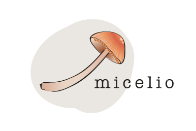

# Group Members
{: .no_toc}

Membership is open to organizations and individuals that are using Wikibase for relevant work and are willing to provide resources for towards the groups [mission](about#mission). If you're interested in joining, please get in touch via email to `dragan.espenschied@rhizome.org`.

1. TOC
{: toc}

All lists in alphabetical order
{: .fs-2}

---

## Organizations

---

{: .float-right .ml-6}

### Code for Science & Society

[CS&S](https://codeforscience.org/) is a US-based nonprofit supporting open collaboration in public interest technology through fiscal sponsorship and other programs supporting sustainable open source.

---

{: .float-right .ml-6}

### Dublin Core Metadata Initiative

The [Dublin Core™ Metadata Initiative](https://dublincore.org/), or "DCMI," is an organization supporting innovation in metadata design and best practices across the metadata ecology.

---

{: .float-right .ml-6}

### Enslaved.org

[Enslaved.org](https://enslaved.org/) is a linked database that allows to explore or reconstruct the lives of individuals who were enslaved, owned slaves, or participated in the historical trade. It is hosted at the [Matrix Center for Digital Humanities & Social Sciences](https://matrix.msu.edu/) at Michigan State University.

---

{: .float-right .ml-6}

### Gene Wiki
[Gene Wiki](https://elifesciences.org/articles/52614) is a project that aims at making wikidata a central hub of linked data in the life sciences. For those use cases where the underlying data is not eligble for inclusion wikibase provides a nice extension to Wikidata. The [WikidataIntegrator](https://github.com/SuLab/WikidataIntegrator) is developed and maintained by this project. 

---

### Micelio

{: .float-right .ml-6}
[Micelio.be](http://www.micelio.be), a consultancy and project participant in the field of open data, semantic web, FAIR, wikidata and Wikibase.

---

### MuseWiki
[MuseWiki](https://muwi.epfl.ch/), a project at EPFL Lausanne, aims at offering a platform to music researchers for collaborative curation of research data.

---

{: .float-right .ml-6}

### OpenRefine
[OpenRefine](https://openrefine.org/) is a powerful open-source tool for cleaning, transforming, and extending data, including Wikibase instances.

---

{: .float-right .ml-6}

### Rhizome

[Rhizome](https://rhizome.org) is a nonprofit organization that champions born-digital art and culture through commissions, exhibitions, scholarship, and digital preservation. Since 2003, Rhizome has been an affiliate in residence at the [New Museum](http://newmuseum.org/) in New York. Rhizome hosts the [ArtBase](https://artbase.rhizome.org/) and [acts as the fiscal sponsor](about#structure) for this group.

---

{: .float-right .ml-6}

### TIB Hannover

[TIB](https://www.tib.eu/en/) is the University Library at Leibniz University, Hannover, and serves as the German National Library of Science and Technology. TIB is actively engaged in promoting Open Access and thus supports unrestricted, free access to scientific information. In cooperation with the scientific community, TIB is testing new methods and tools for supporting the work of researchers.

---

{: .float-right .ml-6}

### UB Mannheim

[UB Mannheim](https://www.bib.uni-mannheim.de) (also known as [Mannheim University Library](https://www.bib.uni-mannheim.de/en)) provides the information and research infrastructure for teaching, learning and research activities at the [University of Mannheim](https://www.uni-mannheim.de/en). UB Mannheim creates a Wikibase knowledge graph with German companies in the project [BERD@BW](https://www.berd-bw.de).

---

{: .float-right .ml-6}

### WESO Research Group

[WESO](https://www.weso.es/) is a research group at the University of Oviedo founded in 2004 with a focus on semantic web, education and technology transfer.

---

{: .float-right .ml-6}

### Wikibase Consultancy

[Wikibase Consultancy](https://wikibase.consulting/) is a collective providing consulting services and solutions on top of Wikibase.

---

{: .float-right .ml-6}

### Wikimedia Deutschland

[Wikimedia Deutschland](https://www.wikimedia.de/) was founded in 2004 as the German chapter of the Wikimedia movement and is leading development on Wikibase and Wikidata.

---

## Individual members
* Alexander Derveaux, FOMU - Fotomuseum Antwerpen
* Daniel Mietchen
* Jasper Koehorst, Wageningen University
* Jeff Mixter, OCLC Research
* Lane Rasberry, School of Data Science at the University of Virginia
* Maarten Brinkerink
* Maarten Zeinstra
* Okko Vainonen, National Library of Finland
* Olaf Janssen, National Library of the Netherlands
* Quentin Groom, Meise Botanic Garden
* Richard Knipel
* Jackie Shieh, Smithsonian Libraries & Archives
